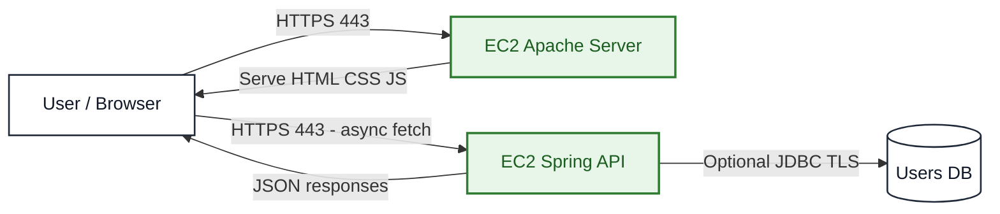
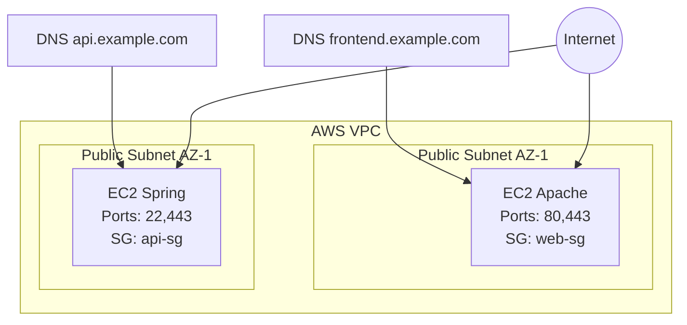
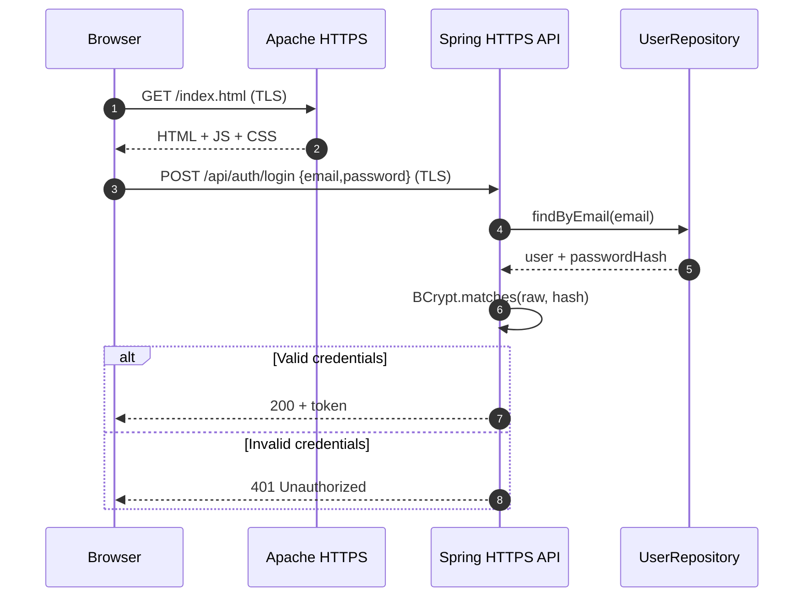
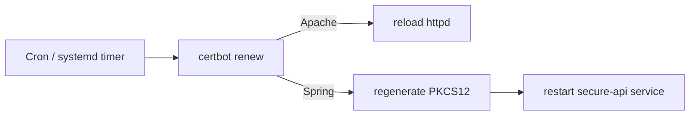

# Secure Application Design on AWS

> Enterprise Architecture Workshop deliverable: a secure, scalable web application deployed on AWS with two servers, end-to-end TLS using Let's Encrypt, an asynchronous HTML+JavaScript client, and login with hashed passwords.


---

## Table of Contents

1. [Lab Summary](#lab-summary)
2. [Security and Architecture Goals](#security-and-architecture-goals)
3. [Target Architecture (2 Servers)](#target-architecture-2-servers)
4. [Mermaid Diagrams](#mermaid-diagrams)
5. [Tech Stack](#tech-stack)
6. [Repository Structure](#repository-structure)
7. [Prerequisites](#prerequisites)
8. [Implementation Step-by-Step](#implementation-step-by-step)
9. [TLS on Both Servers](#tls-on-both-servers)
10. [Secure Login and Password Hashing](#secure-login-and-password-hashing)
11. [Asynchronous Client Served by Apache](#asynchronous-client-served-by-apache)
12. [Testing, Validation, and Evidence](#testing-validation-and-evidence)
13. [Rubric Coverage Checklist](#rubric-coverage-checklist)
14. [Best Screenshots to Capture](#best-screenshots-to-capture)
15. [Recommended Final Video Script](#recommended-final-video-script)
16. [Troubleshooting](#troubleshooting)
17. [Clean Code and 12-Factor Practices](#clean-code-and-12-factor-practices)
18. [Authors and Credits](#authors-and-credits)

---

## Lab Summary

This project implements a secure architecture with two decoupled servers:

- Server 1 (Apache HTTPD): serves the asynchronous HTML+CSS+JavaScript client over HTTPS.
- Server 2 (Spring Boot): exposes secure REST services over HTTPS.

The solution provides:

- Confidentiality and integrity through TLS.
- User authentication with login.
- Secure credential storage with BCrypt hashing.
- Real AWS EC2 deployment with reproducible setup scripts.

---

## Security and Architecture Goals

1. Split frontend and backend into separate servers.
2. Configure TLS for Apache and Spring with Let's Encrypt certificates.
3. Implement secure authentication with password hashing (never store plaintext).
4. Apply least privilege network rules with Security Groups.
5. Deliver reproducible GitHub evidence: source code, documentation, screenshots, and video.

---

## Target Architecture (2 Servers)

- EC2-Apache:
  - Amazon Linux 2023
  - Apache HTTPD
  - Certbot + TLS certificate for frontend domain
  - Static client files

- EC2-Spring:
  - Amazon Linux 2023
  - Java 17 + Maven
  - Spring Boot REST API
  - Certbot + TLS certificate for API domain
  - PKCS12 keystore generated from Let's Encrypt certs

- Flow:
  - Browser downloads client over HTTPS from Apache.
  - Client calls API over HTTPS to Spring.
  - Login validates password against BCrypt hash.

---

## Mermaid Diagrams

### 1) Context Diagram



### 2) Deployment Diagram



### 3) Authentication Sequence



### 4) Certificate Renewal Flow



---

## Tech Stack

- Java 17
- Spring Boot 3.x (Web, Security, Validation, JPA)
- Maven
- Apache HTTPD
- Let's Encrypt + Certbot
- AWS EC2 (Amazon Linux 2023)
- BCrypt password hashing
- HTML5 + CSS3 + JavaScript async/await fetch

---

## Repository Structure

```text
secure-application-design/
├── README.md
├── LICENSE
├── .gitignore
├── apache-client/
│   ├── index.html
│   ├── css/style.css
│   └── js/
│       ├── config.js
│       └── app.js
├── spring-api/
│   ├── pom.xml
│   └── src/
│       ├── main/
│       │   ├── java/com/anderssonprogramming/secureapp/
│       │   └── resources/
│       └── test/
├── scripts/
│   ├── setup-apache.sh
│   ├── setup-spring.sh
│   ├── renew-certs.sh
│   └── SecureUrlReaderExample.java
└── docs/
    ├── architecture/
    ├── deployment/
    └── evidence/
```

---

## Prerequisites

1. AWS account with EC2 and Security Group permissions.
2. Two DNS records pointing to each EC2 instance, for example:
   - frontend.example.com
   - api.example.com
3. SSH key pair to access instances.
4. Local tools:
   - Git
   - Java 17
   - Maven 3.9+

---

## Implementation Step-by-Step

### Step 0. Clone repository

```bash
git clone https://github.com/AnderssonProgramming/secure-application-design.git
cd secure-application-design
```

### Step 1. Create AWS base infrastructure

1. Launch 2 EC2 instances (Amazon Linux 2023):
   - ec2-apache
   - ec2-spring
2. Assign Elastic IPs (recommended).
3. Configure Security Groups:

- web-sg (Apache):
  - 22/tcp from your admin IP
  - 80/tcp from Internet
  - 443/tcp from Internet

- api-sg (Spring):
  - 22/tcp from your admin IP
  - 443/tcp from Internet
  - optional temporary 80/tcp for certbot standalone challenge

### Step 2. Configure Apache server

```bash
ssh -i your-key.pem ec2-user@<APACHE_IP>
cd ~/secure-application-design
chmod +x scripts/setup-apache.sh
./scripts/setup-apache.sh frontend.example.com https://api.example.com
```

### Step 3. Configure Spring server

```bash
ssh -i your-key.pem ec2-user@<SPRING_IP>
cd ~/secure-application-design
chmod +x scripts/setup-spring.sh
./scripts/setup-spring.sh api.example.com https://frontend.example.com YOUR_KEYSTORE_PASSWORD
```

### Step 4. Verify HTTPS endpoints

```bash
curl -I https://frontend.example.com
curl -I https://api.example.com/api/public/health
```

### Step 5. Verify authentication flow

- Register user from frontend UI.
- Log in and obtain token.
- Call protected endpoint /api/secure/me.
- Confirm unauthorized response without token.

---

## TLS on Both Servers

Validation matrix:

| Component | Domain | Port | Certificate | Validation |
| --- | --- | ---: | --- | --- |
| Apache Frontend | frontend.example.com | 443 | Let's Encrypt | Browser lock + curl |
| Spring API | api.example.com | 443 | Let's Encrypt (PKCS12 in Spring) | curl + openssl |

Useful commands:

```bash
openssl s_client -connect frontend.example.com:443 -servername frontend.example.com
openssl s_client -connect api.example.com:443 -servername api.example.com
sudo certbot certificates
```

---

## Secure Login and Password Hashing

Minimum demonstrable requirement:

- Passwords are stored only as BCrypt hash values (for example starting with $2a$, $2b$, or $2y$), never plaintext.

Validation:

1. Register user.
2. Confirm hash in database.
3. Successful login returns 200.
4. Invalid login returns 401.
5. Protected endpoint without token returns 401/403.

---

## Asynchronous Client Served by Apache

Frontend checklist:

- Delivered over HTTPS.
- Uses async/await fetch API.
- Clear user-facing error handling.
- No secrets embedded in client JavaScript.
- API base URL set through config file.

---

## Testing, Validation, and Evidence

### Functional tests

1. GET frontend over HTTPS.
2. POST login over HTTPS.
3. GET protected endpoint with token.
4. GET protected endpoint without token.

### Security tests

1. HTTP to HTTPS redirect verified.
2. Certificates valid and not expired.
3. BCrypt hashes stored in DB.
4. CORS restricted to frontend origin.

### Deployment tests

1. Service survives instance reboot.
2. httpd and secure-api start automatically.
3. Certificate renewal dry-run passes.

```bash
sudo certbot renew --dry-run
```

---

## Rubric Coverage Checklist

### Class Work (50%)

- Participation and collaboration evidence included.
- AWS deployment completed with two servers.
- Apache and Spring configured on separate instances.
- TLS configured for frontend and API.
- Login security implemented with hashed passwords.
- Let's Encrypt certificates installed on both servers.
- Source code and documentation delivered in GitHub.

### Homework (50%)

- Detailed architecture design documented.
- Clear relationship between Apache, Spring, and async client.
- Secure AWS deployment strategy explained.
- Working secure implementation delivered.
- Final deliverables include README, screenshots, and demo video.

---

## Best Screenshots to Capture

Store images in an images/ folder with stable names.

Required:

1. aws-01-ec2-list.png - both EC2 instances running.
2. aws-02-security-groups.png - inbound/outbound rules.
3. dns-01-records.png - DNS records to both public IPs.
4. apache-01-httpd-running.png - systemctl status httpd.
5. apache-02-frontend-https.png - frontend loaded on HTTPS.
6. apache-03-certificate-lock.png - browser certificate lock details.
7. spring-01-java-maven-version.png - java -version and mvn -version.
8. spring-02-service-running.png - systemctl status secure-api.
9. spring-03-api-health-https.png - API health endpoint over HTTPS.
10. tls-01-certbot-apache.png - certbot success on Apache.
11. tls-02-certbot-spring.png - certbot success on Spring.
12. tls-03-openssl-pkcs12.png - PEM to PKCS12 conversion.
13. auth-01-login-ui.png - login/register UI.
14. auth-02-login-success.png - successful login response.
15. auth-03-login-failed.png - invalid credentials response.
16. auth-04-db-password-hash.png - hashed password in DB.
17. api-01-protected-with-token.png - protected endpoint success.
18. api-02-protected-without-token.png - unauthorized response.
19. security-01-http-to-https-redirect.png - redirect proof.
20. ci-01-tests-passing.png - Maven tests passing.

Optional high-score additions:

1. renewal-01-certbot-dry-run.png
2. headers-01-security-headers.png
3. logs-01-apache-logs.png
4. logs-02-spring-logs.png
5. architecture-01-mermaid-rendered.png

---

## Recommended Final Video Script

Suggested duration: 6 to 10 minutes.

1. Explain challenge scope and security objectives.
2. Present two-server architecture and trust boundaries.
3. Show AWS resources and security groups.
4. Demonstrate frontend over HTTPS.
5. Demonstrate API over HTTPS.
6. Demonstrate login success and failure.
7. Show BCrypt hash evidence and protected endpoint behavior.
8. Show certbot renewal dry-run.
9. Close with rubric coverage summary.

---

## Troubleshooting

1. Certbot domain validation fails:
   - Verify DNS A records and propagation.
   - Temporarily open port 80 for ACME challenge.
2. Spring API does not start on 443:
   - Verify keystore path and password variables.
   - Check logs with journalctl -u secure-api -f.
3. CORS errors from frontend:
   - Verify APP_CORS_ALLOWED_ORIGINS exactly matches frontend https origin.
4. Renewal not applied:
   - Run certbot renew --dry-run.
   - Validate cron/systemd timer and renewal hooks.

---

## Clean Code and 12-Factor Practices

1. Keep configuration in environment variables.
2. Use clear layer separation: controller, service, repository, security.
3. Use DTOs for request/response boundaries.
4. Use centralized exception handling.
5. Avoid logging secrets.
6. Keep one codebase for all environments.
7. Keep deployment scripts versioned and reproducible.

Recommended variables:

- APP_CORS_ALLOWED_ORIGINS
- DB_URL
- DB_USERNAME
- DB_PASSWORD
- KEYSTORE_PASSWORD
- KEYSTORE_PATH
- KEYSTORE_ALIAS

---

## Authors and Credits

- Student: Andersson David Sanchez Mendez
- Course: Enterprise Architectures / Secure Application Design
- Instructor: Luis Daniel Benavides Navarro
- Institution: Escuela Colombiana de Ingenieria Julio Garavito

---

## License

This project is licensed under the MIT License.
