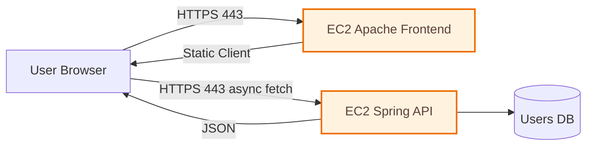
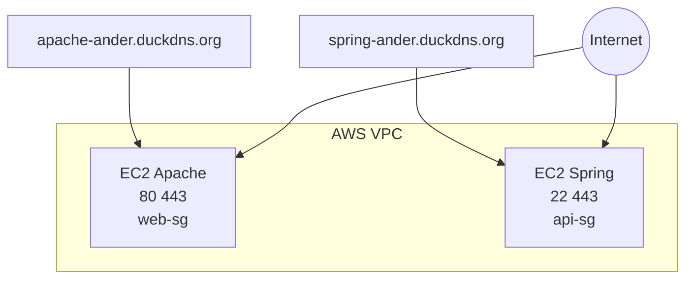
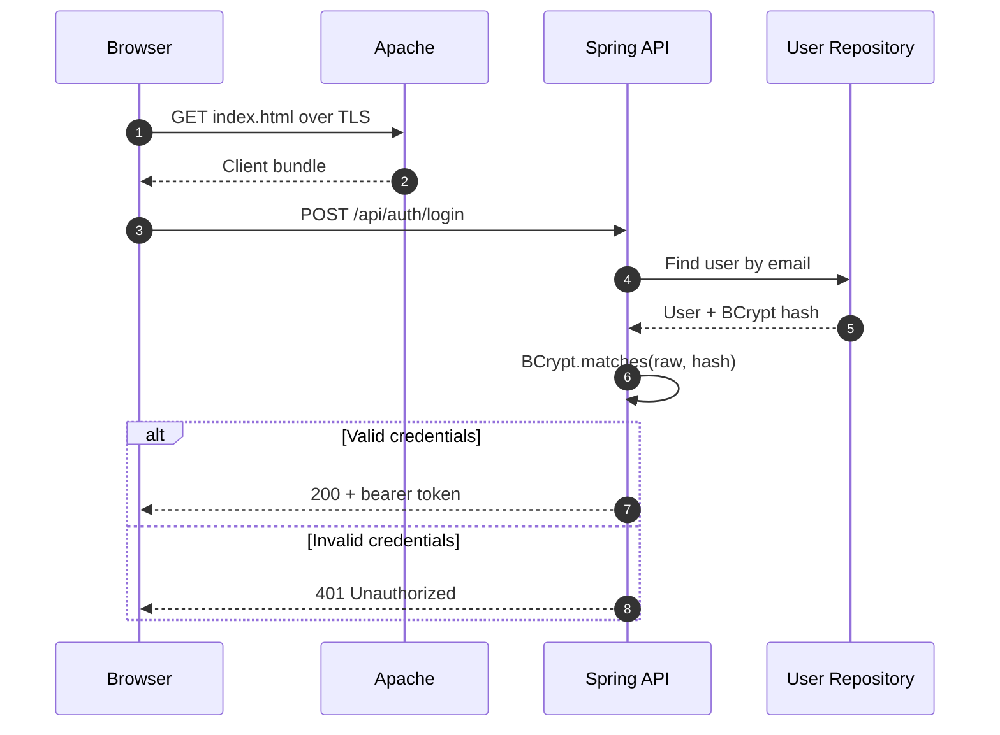
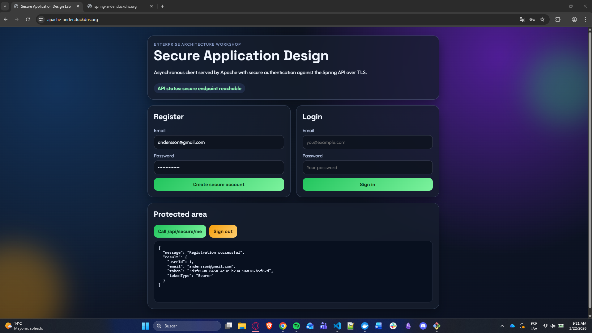
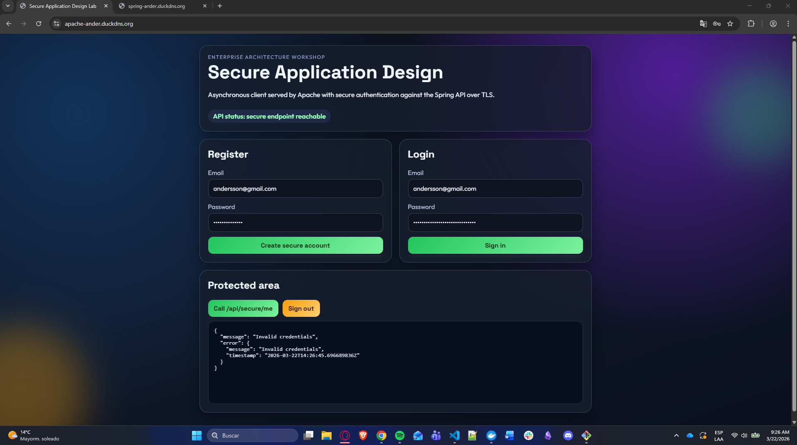
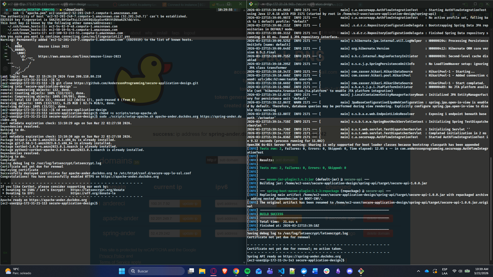

# Secure Application Design


## Secure by Design, Proven with Evidence

Welcome to my final secure full-stack delivery for the Enterprise Architecture workshop.

This project combines:

- 🔐 End-to-end HTTPS with Let's Encrypt
- 🧠 Secure authentication with BCrypt hashing
- 🧱 Split architecture with two isolated EC2 servers
- ⚡ Async frontend calls from Apache to Spring API
- ✅ Complete evidence pack (screenshots + video)

---

## Quick Navigation

1. [Project Snapshot](#project-snapshot)
2. [Architecture at a Glance](#architecture-at-a-glance)
3. [Evidence Gallery](#evidence-gallery)
4. [Video Walkthrough](#video-walkthrough)
5. [AWS Deployment Runbook](#aws-deployment-runbook)
6. [Security Controls](#security-controls)
7. [Validation Matrix](#validation-matrix)
8. [Rubric Coverage](#rubric-coverage)
9. [Repository Structure](#repository-structure)

---

## Project Snapshot

| Area | Delivery |
| --- | --- |
| Frontend | Apache serves async HTML/CSS/JS over HTTPS |
| Backend | Spring Boot secure API over HTTPS |
| Auth | Register/Login with BCrypt password verification |
| TLS | Certificates installed on both frontend and backend |
| Infra | 2 EC2 instances + least-privilege SG rules |
| Evidence | All required screenshots + final video |

---

## Architecture at a Glance

### Context Diagram



### Deployment Diagram



### Authentication Sequence



---

## Evidence Gallery

All evidence files are in [images](images).

| # | Evidence | Description | File |
| --- | --- | --- | --- |
| 1 | EC2 Instances | Both frontend and backend servers running | [images/aws-01-ec2-list.png](images/aws-01-ec2-list.png) |
| 2 | Security Groups | Inbound rules correctly configured | [images/aws-02-security-groups.png](images/aws-02-security-groups.png) |
| 3 | DNS Records | DuckDNS records for both servers | [images/dns-01-records.png](images/dns-01-records.png) |
| 4 | Frontend HTTPS | Apache client loaded with TLS | [images/apache-02-frontend-https.png](images/apache-02-frontend-https.png) |
| 5 | API HTTPS Health | Public health endpoint over TLS | [images/spring-03-api-health-https.png](images/spring-03-api-health-https.png) |
| 6 | Certbot Apache | Certificate workflow on Apache server | [images/tls-01-certbot-apache.png](images/tls-01-certbot-apache.png) |
| 7 | Certbot Spring | Certificate workflow on Spring server | [images/tls-02-certbot-spring.png](images/tls-02-certbot-spring.png) |
| 8 | Register Success | User registration successful | [images/auth-02-register-success.png](images/auth-02-register-success.png) |
| 9 | Login Success | Authentication with valid credentials | [images/auth-02-login-success.png](images/auth-02-login-success.png) |
| 10 | Login Failure | Invalid credentials correctly rejected | [images/auth-03-login-failed.png](images/auth-03-login-failed.png) |
| 11 | BCrypt Proof | Password stored as BCrypt hash | [images/auth-04-db-password-hash.png](images/auth-04-db-password-hash.png) |
| 12 | Protected Endpoint | Access granted with valid token | [images/api-01-protected-with-token.png](images/api-01-protected-with-token.png) |
| 13 | Tests Passing | Maven test suite completed successfully | [images/ci-01-tests-passing.png](images/ci-01-tests-passing.png) |

### Visual Highlights

#### Frontend over TLS 🔒


#### API Health over TLS 💚


#### Register/Login Flow 👤





#### Token-Protected Endpoint 🛡️


#### Test Execution ✅



---

## Video Walkthrough

The full demonstration video is included in the repository:

- 🎬 [secure-application-design.mp4](https://youtu.be/Y3e6ZtWets8)

Video flow:

1. Objective and architecture boundaries
2. AWS resources and security groups
3. Frontend over HTTPS
4. API over HTTPS
5. Register/Login success and failure
6. BCrypt evidence in storage
7. Protected endpoint behavior
8. Certbot dry-run and tests
9. Rubric mapping and close

---

## AWS Deployment Runbook

Detailed deployment instructions are available in:

- [AWS_DEPLOYMENT_GUIDE.md](AWS_DEPLOYMENT_GUIDE.md)

The runbook includes prerequisites, exact commands, TLS setup, renewal flow, and troubleshooting.

---

## Security Controls

| Control | Implementation |
| --- | --- |
| Data in transit | HTTPS/TLS on frontend and backend |
| Credential protection | BCrypt password hashing |
| Access control | Token-protected secure endpoints |
| Network hardening | Isolated SG rules per server role |
| Certificate lifecycle | Let's Encrypt + renewal script |
| Config hygiene | Environment-driven secure runtime config |

---

## Validation Matrix

| Test | Expected Result |
| --- | --- |
| GET frontend over HTTPS | 200 and valid certificate |
| GET /api/public/health | 200 and JSON status UP |
| POST /api/auth/register | 201 and token issued |
| POST /api/auth/login (valid) | 200 and token issued |
| POST /api/auth/login (invalid) | 401 Unauthorized |
| GET /api/secure/me with token | 200 and profile payload |
| GET /api/secure/me without token | 401 or 403 |
| certbot renew --dry-run | Success |
| mvn test | BUILD SUCCESS |

---

## Rubric Coverage

### Class Work

- ✅ Two-server AWS deployment completed
- ✅ Apache and Spring configured independently
- ✅ TLS for frontend and API communication
- ✅ Secure login with hashed password storage
- ✅ Let's Encrypt certificates active in both tiers
- ✅ Full repository delivery with proof artifacts

### Homework

- ✅ Architecture and secure design clearly documented
- ✅ Correct Apache-Spring-async client interaction
- ✅ Working secure implementation demonstrated
- ✅ Final assets include README, screenshots, and video

---

## Repository Structure

```text
secure-application-design/
├── README.md
├── AWS_DEPLOYMENT_GUIDE.md
├── secure-application-design.mp4
├── LICENSE
├── .gitignore
├── images/
│   ├── aws-01-ec2-list.png
│   ├── aws-02-security-groups.png
│   ├── dns-01-records.png
│   ├── apache-02-frontend-https.png
│   ├── spring-03-api-health-https.png
│   ├── tls-01-certbot-apache.png
│   ├── tls-02-certbot-spring.png
│   ├── auth-02-register-success.png
│   ├── auth-02-login-success.png
│   ├── auth-03-login-failed.png
│   ├── auth-04-db-password-hash.png
│   ├── api-01-protected-with-token.png
│   └── ci-01-tests-passing.png
├── apache-client/
├── spring-api/
└── scripts/
```

---

## Authors and Credits

- Student: Andersson David Sanchez Mendez
- Course: Enterprise Architectures / Secure Application Design
- Instructor: Luis Daniel Benavides Navarro
- Institution: Escuela Colombiana de Ingenieria Julio Garavito

## License

This project is licensed under the MIT License. See [LICENSE](LICENSE).
