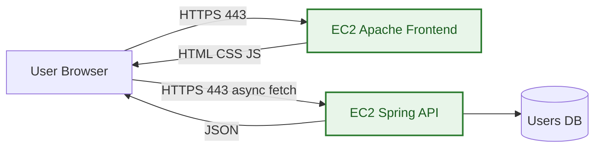
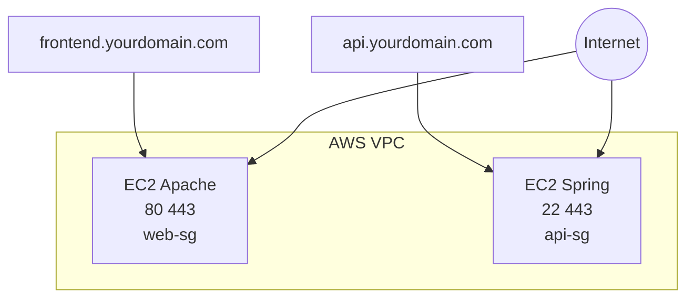
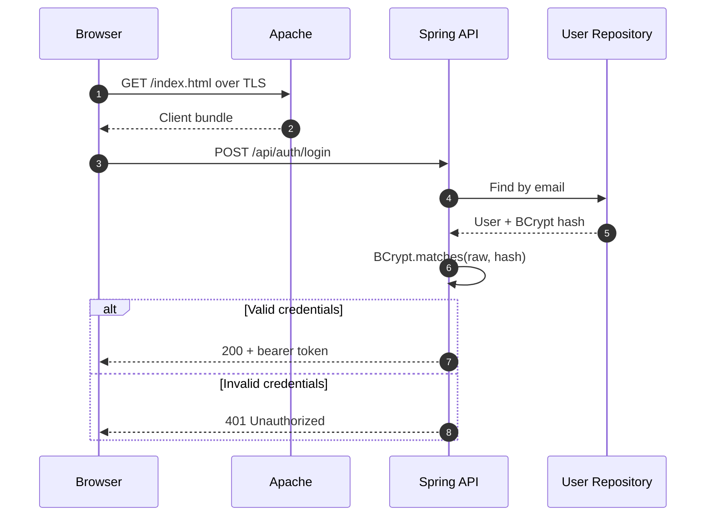
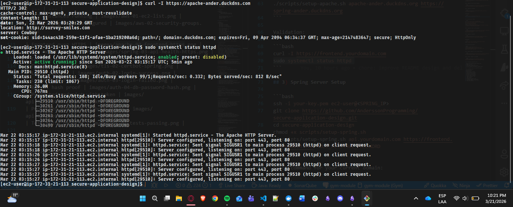
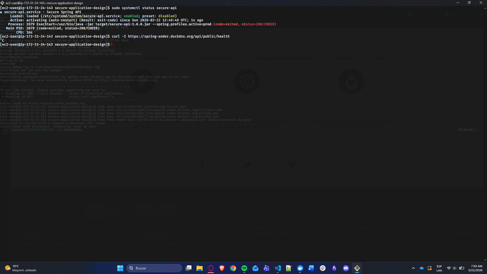
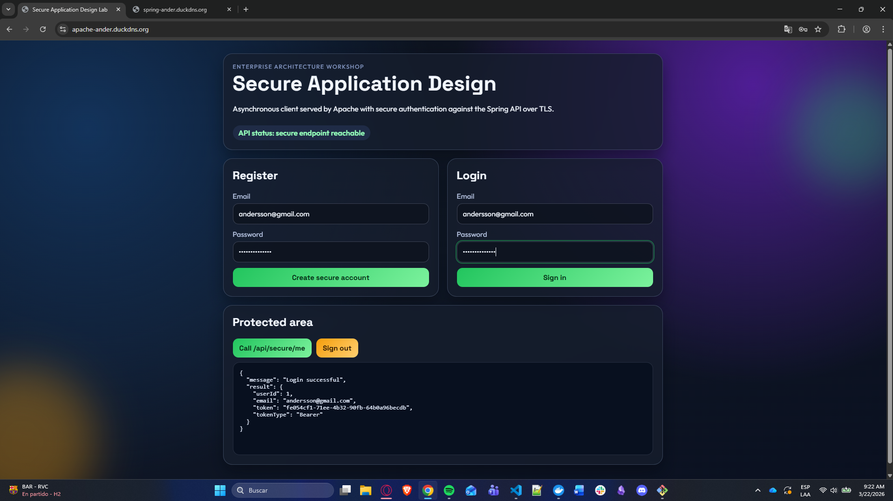
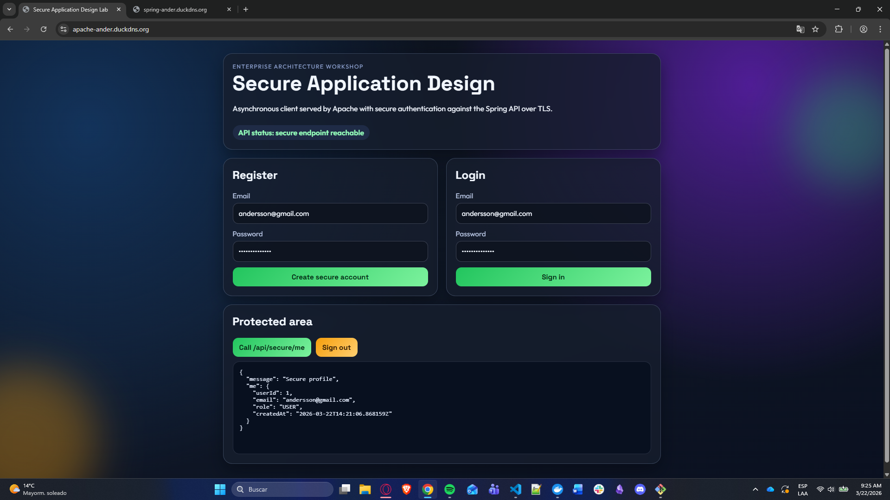

# Secure Application Design


Full-stack secure lab delivery with two isolated servers, HTTPS end-to-end, async client calls, and authentication with hashed passwords.

---

## Quick Navigation

1. [Project Snapshot](#project-snapshot)
2. [Architecture at a Glance](#architecture-at-a-glance)
3. [Live Evidence Gallery](#live-evidence-gallery)
4. [AWS Deployment Runbook](#aws-deployment-runbook)
5. [Implementation Flow](#implementation-flow)
6. [Security Controls](#security-controls)
7. [Test and Validation Matrix](#test-and-validation-matrix)
8. [Rubric Coverage](#rubric-coverage)
9. [Video Walkthrough Script](#video-walkthrough-script)

---

## Project Snapshot

| Area | What is delivered |
| --- | --- |
| Client Tier | Apache serves an asynchronous HTML+JS client over HTTPS |
| API Tier | Spring Boot exposes secure REST endpoints over HTTPS |
| Identity | Register + login flow with BCrypt password hashing |
| Transport Security | TLS certificates from Let's Encrypt on both servers |
| Infra | Two independent EC2 instances with least-privilege security groups |
| Delivery Assets | Complete codebase, visual README, deployment guide, screenshot plan |

---

## Architecture at a Glance

### Context



### Deployment



### Authentication Sequence



---

## Live Evidence Gallery

All screenshots will be stored in [images](images).

### Required Evidence

| Evidence | File |
| --- | --- |
| EC2 instances running | images/aws-01-ec2-list.png |
| Security groups configured | images/aws-02-security-groups.png |
| DNS records | images/dns-01-records.png |
| Frontend over HTTPS | images/apache-02-frontend-https.png |
| API health over HTTPS | images/spring-03-api-health-https.png |
| Certbot Apache | images/tls-01-certbot-apache.png |
| Certbot Spring | images/tls-02-certbot-spring.png |
| Login success | images/auth-02-login-success.png |
| Login failure | images/auth-03-login-failed.png |
| BCrypt hash proof | images/auth-04-db-password-hash.png |
| Protected endpoint with token | images/api-01-protected-with-token.png |
| Protected endpoint without token | images/api-02-protected-without-token.png |
| Test suite passing | images/ci-01-tests-passing.png |

### Gallery Placeholders

> Replace these placeholders once screenshots are captured.






---

## AWS Deployment Runbook

Use the dedicated deployment guide:

- [AWS_DEPLOYMENT_GUIDE.md](AWS_DEPLOYMENT_GUIDE.md)

This guide includes:

1. Prerequisites checklist
2. Exact execution order
3. Copy-paste commands for Apache and Spring servers
4. TLS issuance and PKCS12 conversion
5. Validation commands and screenshot checkpoints

---

## Implementation Flow

1. Launch and secure two EC2 instances.
2. Configure DNS records for frontend and API domains.
3. Deploy Apache client and enforce HTTPS.
4. Deploy Spring API and configure TLS in production profile.
5. Validate auth flow, protected routes, and CORS policy.
6. Execute test suite and capture evidence.

---

## Security Controls

| Control | Implementation |
| --- | --- |
| Data in transit | HTTPS/TLS for frontend and API |
| Credential security | BCrypt hash storage, no plaintext passwords |
| Access control | Token-protected endpoints |
| Network hardening | Separate SGs and restricted ingress |
| Certificate lifecycle | Let's Encrypt issuance and renewal script |
| Configuration hygiene | Runtime config through environment variables |

---

## Test and Validation Matrix

| Test | Expected result |
| --- | --- |
| GET frontend over HTTPS | 200 and valid TLS certificate |
| POST /api/auth/register | 201 and token issued |
| POST /api/auth/login valid | 200 and token issued |
| POST /api/auth/login invalid | 401 Unauthorized |
| GET /api/secure/me with token | 200 and user profile |
| GET /api/secure/me without token | 401 or 403 |
| certbot renew --dry-run | Success |
| mvn test | BUILD SUCCESS |

---

## Rubric Coverage

### Class Work

- Two-server AWS deployment completed.
- Apache and Spring configured independently.
- TLS configured for client download and API requests.
- Login security implemented with hashed password storage.
- Let's Encrypt certificates installed on both servers.
- Complete repository with code and documentation.

### Homework

- Detailed architecture and secure design documented.
- Correct relationship between Apache, Spring, and async client explained.
- Working secure implementation demonstrated.
- Final assets include README, screenshots, and video.

---

## Video Walkthrough Script

1. Introduce objective and architecture boundaries.
2. Show AWS resources and security groups.
3. Demonstrate frontend over HTTPS.
4. Demonstrate API over HTTPS.
5. Show register/login success and failure.
6. Show BCrypt hash evidence in storage.
7. Show protected endpoint behavior with and without token.
8. Run certbot dry-run and tests.
9. Close with rubric mapping.

---

## Repository Structure

```text
secure-application-design/
├── README.md
├── AWS_DEPLOYMENT_GUIDE.md
├── LICENSE
├── .gitignore
├── images/                         # screenshot evidence (you will add files)
├── apache-client/
├── spring-api/
└── scripts/
```

---

## Authors and Credits

- Student: Andersson David Sanchez Mendez
- Course: Enterprise Architectures / Secure Application Design
- Instructor: Luis Daniel Benavides Navarro
- Institution: Escuela Colombiana de Ingenieria Julio Garavito

## License

This project is licensed under the MIT License.
